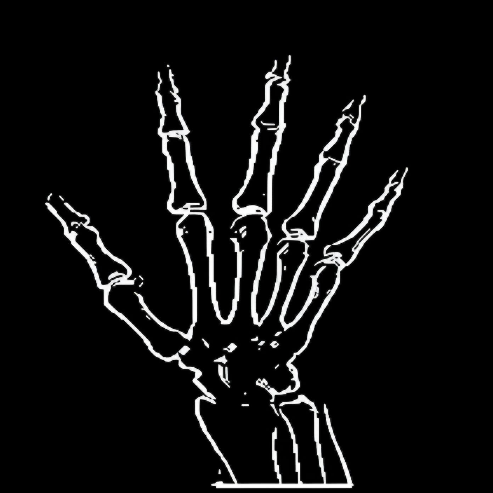

  <h1>
    Huesitos - Análisis de Imágenes Médicas
  </h1>

<h4>
    Evaluación de métodos numéricos frente a librerías especializadas en el procesamiento de imágenes médicas para la detección de fracturas mediante Machine Learning
  </h4>

## Archivos del Proyecto
- **Código Completo**: [Huesitos oficial.ipynb](https://colab.research.google.com/drive/1SJFYFFf2br52FX5klEi5-IvTaz96i0iF?usp=sharing)
- **Código Interactivo**: [Huesitos Interactivo.ipynb](https://colab.research.google.com/drive/1oP0OVE7_GxZskS8KLvuDGZrwrRYXA0rX?usp=sharing)
- **Modelo de IA**: [+87.h5](https://drive.google.com/file/d/1VUW9Els6pUxWx-oaJ3-2jrqu1Li9rlGf/view?usp=sharing)

## Instrucciones de Uso

### Para "Huesitos oficial.ipynb"
1. Asegúrate de que las celdas estén comprimidas para mayor agilidad.
2. Ejecuta las secciones necesarias (Librerías, Extracción de Dataset, etc.).
3. En la sección de modelado, elige entre **Búsqueda** o **Load**.
4. Continúa con Análisis, AUC y Gradio.
5. Explora cada sección según tus necesidades.

### Para "Huesitos Interactivo.ipynb"
1. Descarga y carga el modelo [+87.h5](https://drive.google.com/file/d/1VUW9Els6pUxWx-oaJ3-2jrqu1Li9rlGf/view?usp=sharing).
2. Ejecuta todas las celdas en Colab.
3. Utiliza Gradio para probar imágenes.

## Equipo
- Laura Gómez (Lead)
- Felipe Benítez

----
Se recomienda leer el informe: [Informe Huesitos por F. Benítez y L. Gómez (PDF)](https://github.com/slrosales/huesitos/blob/main/Informe_Huesitos_por_F__Benítez_y_L__Gómez%20(1).pdf)

----

## Resumen
Este estudio se enfoca en la aplicación de técnicas de Machine Learning para la detección de fracturas en imágenes médicas, un área emergente en la intersección de la medicina y la ingeniería de sistemas. La investigación se centra en desarrollar un modelo automatizado que emplea redes neuronales convolucionales (CNN) para clasificar imágenes radiográficas en categorías específicas: con fractura, sin fractura, o no identificada cuando la certeza del modelo es inferior al 25\%. Este enfoque busca mejorar la precisión y rapidez de los diagnósticos médicos, contribuyendo a una atención médica más eficiente y reduciendo los errores humanos.

En el proceso, se ha creado un conjunto de datos denominado "Huesitos", que incluye 326 imágenes con indicadores de fractura y 300 imágenes sin evidencia de fractura. Este conjunto de datos busca proporcionar un balance adecuado para el entrenamiento del modelo. Además, se han aplicado técnicas de preprocesamiento de imágenes y extracción de características, como Gradientes, el método de Otsu, método de HOG y Haralick.

A pesar de la inexperiencia inicial del equipo en el área específica de la detección de fracturas mediante técnicas de aprendizaje automático, se ha logrado un avance significativo en la comprensión y aplicación de estos métodos numéricos enfocados en la visión por computadora. 

## Metodología

### 1. Creación de Dataset Huesitos
Desarrollo de un conjunto de datos específico que apoye la detección de fracturas.

### 2. Preprocesamiento de Imágenes
2.1. Escala de grises, normalización y redimensionamiento de imágenes
Adaptación de imágenes médicas a un formato estándar para el análisis.

2.2. Normalización
Uniformidad en la escala de intensidad de las imágenes.

2.3. Histograma de Intensidades (escala gris)
Análisis de la distribución de intensidad en las imágenes.

### 6.3. Extracción de características
3.1. Gradiente de una imagen
Determinación de bordes y texturas relevantes.

3.2. Método de HOG
Caracterización de formas locales y estructuras en la imagen.

3.3. Método de Otsu
Segmentación basada en el umbral para separar áreas de interés.

3.4. Método de Haralick
Extracción de características de textura para la clasificación.

### 4. Proceso con Python
Implementación del análisis utilizando el lenguaje de programación Python, aprovechando sus numerosas bibliotecas para el procesamiento de datos y aprendizaje automático.

